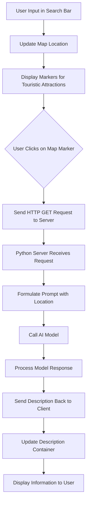

# Descriptive Map

A fullstack app that shows the touristic attractions in an area and a description for each of them, generated using the Cohere AI model.


## Features
- **Location Search Bar** - Search the desired location to get a map of the wider area
- **Interactive Map** - Drag the map for increased precision, with color-coded interactive markers
- **AI-Powered Description Generation** - Click on a marker to get a detailed description of the specific attraction, generated by the Cohere AI model


## Flow Diagram




## Tech Stack

### Frontend
- **React 19.1.0+** - Node.js framework
- **Mapbox API** - For map display, geolocation services and markers
- **Node.js** - For client functionalities and requests to the server
- **HTML5/CSS3** - Modern web standards

### Backend
- **Python 3.12.3** - Flask server, communication with the Cohere AI model and .env handling
- **Cohere AI** - Text generation model


## Installation

### Prerequisites
- **React 19.1.0+ and npm**
- **Valid API token for Mapbox API**
- **Valid API key for Cohere API**
- **Python 3.12.3**


### Setup
- **Clone the repository**
    ```bash
    git clone https://github.com/EnacheAdrian05/DescriptiveMap.git
    cd frontend
    ```
- **Create a .env file with the following content**
    ```env
    VITE_MAPBOX_API_TOKEN=your-mapbox-token
    ```
- **Install dependencies**
    ```bash
    npm install
    ```
- **Run the development server**
    ```bash
    npm run dev
    cd ..\backend
    ```
- **The React app will run at http://localhost:5173/**
- **Create another .env file with the following content**
    ```env
    COHERE_API_KEY=your-cohere-key
    TEMPERATURE=your-preferred-temperature
    FRONTEND_STATIC_PATH=../frontend/dist
    ```
- **Run the backend server**
    ```bash
    python server.py
- **The Flask app will run at http://localhost:5000/**


## API Documentation

### GET /generate

#### Request
- **Method** : GET
- **Path Variable** : &promptt={detailed prompt for location description}

#### Response
- **Body** : {"response" : the generated description}
